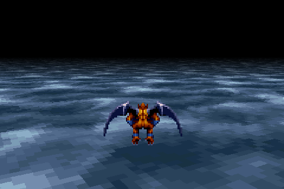

# Overview

This project is a software-rendered Mode 7 demo using JavaScript and the HTML5 Canvas API. Inspired by classic 16-bit games like Super Mario Kart and F-Zero, Mode 7 was a revolutionary SNES graphics mode that simulated 3D perspective on a 2D plane. This demo replicates that effect, using mathematical transformations and trigonometry to achieve real-time floor rendering and sprite animation, complete with camera movement and rotation, all drawn directly on a canvas.

# Notes

The demo renders two horizontal pixels at a time. If you wish to modify this, remember to update the ```can.width / 4``` sections accordingly. Adjusting the horizon and scale factor allows you to change the perspective for different visual effects.

# Live demo

A live demo is available at [https://www.hugosmits.nl/mode7](https://www.hugosmits.nl/mode7).

# Assets

The texture and sprite are sourced from the intro of the SNES game Demon’s Crest. The texture has been converted into a texture array and a palette array to optimize drawing performance.

# Screenshot


